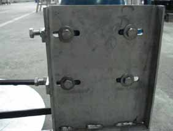
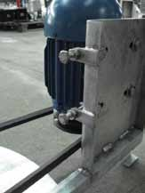
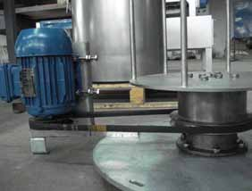

A família de equipamentos INCALFER possui projeto mecânico e elétrico de alta
tecnologia que leva em consideração condições severas de trabalho, com o
objetivo de dotá-los de tal robustez que, por este motivo, normalmente as peças
mecânicas não requerem nenhum tipo de manutenção desde que o
equipamento seja utilizado dentro dos parâmetros citados neste manual.
Seguem abaixo as únicas preocupações que os clientes da INCALFER devem
ter no tocante a Manutenção Preventiva:

# Limpeza
Ao terminar de utilizar a máquina tem-se que proceder a limpeza da mesma.
Esta se realiza primeiro lavando com uma mangueira as superfícies interiores e
exteriores. Se ficar algum detrito ou sujeira pode-se retirar manualmente
(sempre com o equipamento devidamente desligado da fonte de energia).

# Limpeza dos contatos elétricos
Se o seu equipamento opera em ambiente adverso, recomenda-se que
ocasionalmente se verifique os contatos da tomada de força.

# Tensão da Correia
Se for observado que a máquina não alcança a velocidade desejada ou que não
freia totalmente, pode ocorrer que a correia esteja muito frouxa.
Para esticar a mesma tem que parar, para esticá-la terá que se cumprir vários
passos para desmontar e montá-la.

1. Tirar o porta cesto. Tirar todos os parafusos que estão no centro do porta
cesto (são sete parafusos).
2. Retirar a cobertura do motor.
3. Retirar a bateia, tirando os parafusos que estão na parte inferior externa, que
a fixam na base. Levantar toda a bateia. Deste jeito aparecerá todo o sistema
de transmissão.
4. Para esticar a correia, afrouxe os parafusos que fixam o motor e mover o
motor para o lado contrário ao eixo principal, com o auxílio do esticador.
Conforme FOTOS 1 e 2.
5. Verificar que as duas polias se encontrem na mesma altura para que a correia
não trabalhe cruzada. Conforme FOTO 3.
6. Proceder à montagem.

  

# Lubrificação
O suporte do eixo de rotação é uma bucha de bronze sobre a qual um rolamento
axial suporta o peso do conjunto rotor.
É muito importante manter lubrificado com graxa este mecanismo, para
conseguir prolongar a vida do conjunto mecânico.
Para isso, tem que ser engraxado 1 vez a cada 8 horas de uso. A engraxadeira
é colocada na máquina para tal finalidade.
Para engraxar é preciso apenas retirar o cesto e no bico da engraxadeira que
está localizada no centro do porta cesto, engraxa-se (a engraxadeira fornecida
pela INCALFER) e se faz a lubrificação. Conforme foto abaixo: